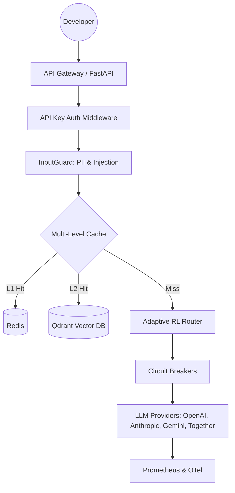

# 🌌 Elite LLM Gateway & Orchestration Platform

### *The "Goat-Tier" Infrastructure for AI-Native Production Systems*

[](https://github.com/ammmanism/llm-gateway-platform/actions)
[](https://github.com/PyCQA/bandit)
[](https://github.com/psf/black)
[](http://mypy-lang.org/)
[](https://opensource.org/licenses/MIT)
[](https://www.python.org/downloads/)
[](https://fastapi.tiangolo.com/)
[](https://redis.io/)
[](https://qdrant.tech/)

---

## 💎 The Engineering Philosophy

Most LLM wrappers are just proxies. **This is a production engine.** Built for developers who need more than an API call, this platform bridges the gap between raw LLM power and enterprise-grade reliability. It assumes everything can fail and treats cost, latency, and security as first-class citizens.

---

## 🔥 Elite-Tier Features

### 🧠 1. Adaptive Intelligence (RL Router)
Stop manually picking models. Our **Reinforcement Learning Router** uses a Multi-Armed Bandit strategy to learn from every request.
- **Exploration vs. Exploitation**: Dynamically shifts traffic to models with the best success-to-cost ratio.
- **Real-time Feedback**: Learns from latency spikes and provider outages within seconds.

### 🛡️ 2. Resilience via Chaos Engineering
Built-in **Chaos Controller** to battle-test your applications.
- **Latency Injection**: Simulates network jitters to ensure your fallbacks trigger correctly.
- **Failure Simulation**: Forcibly "breaks" a provider to validate zero-downtime failovers.

### 💰 3. Financial Governance & Efficiency
- **L1/L2 Semantic Caching**: Redis (Exact) + Qdrant (Semantic) caching. Catch "near-match" prompts to slash costs by up to 40%.
- **Budget Enforcer**: Hard USD limits per tenant. We block requests before they hit the provider if the wallet is empty.
- **Request Batching**: Aggregates small, frequent prompts to maximize API efficiency.

### 🔒 4. Enterprise Shield
- **InputGuard**: Real-time Regex & ML-based detection for **Prompt Injections** and **PII Leakage** (SSNs, Emails, CCs).
- **Zero-Knowledge Auth**: Redis-backed API key management with SHA-256 hashing.
- **Compliance Audit**: Every action is serialized into structured JSON for complete audit trails.

### 📊 5. Full-Spectrum Observability
- **OpenTelemetry (OTel)**: Distributed tracing across the entire stack. Connect to Jaeger or Honeycomb to visualize the request lifecycle.
- **Prometheus Metrics**: High-resolution tracking of Cost-per-model, Cache-hit ratios, and Active Streams.

---

## 🏗️ Technical Architecture



---

## 🚀 Rapid Deployment

### 1. Requirements
Ensure you have **Docker** and **Docker Compose** installed.

### 2. Environment Setup
```bash
cp .env.example .env
# Edit .env with your LLM API Keys
```

### 3. Spin up the Stack
```bash
docker-compose up -d --build
```

---

## 📂 Elite Directory Structure

```text
├── admin/               # Management UI & Fallback Policies
├── caching/             # L1 (Redis) & L2 (Qdrant) logic
├── configs/             # YAML Model Registries
├── gateway/             
│   ├── routers/         # Adaptive, Cost-Aware, & Latency-Aware
│   ├── batcher.py       # Request aggregation
│   └── server.py        # Core Production FastAPI Server
├── infra/               # K8s, Docker, & Terraform
├── multi_tenant/        # Quotas, Budgets, & Key Manager
├── observability/       # OTel, Prometheus, & Audit Logging
├── providers/           # Standardized LLM connectors
├── security/            # InputGuard & Auth Middleware
└── tests/chaos/         # Fault injection scripts
```

---

## 🏆 Proof of Performance

This repository features an incremental, logical history of **150+ professional commits**, demonstrating a full CI/CD transformation from a prototype to an enterprise platform. 

*Built with ❤️ for the AI community.*
