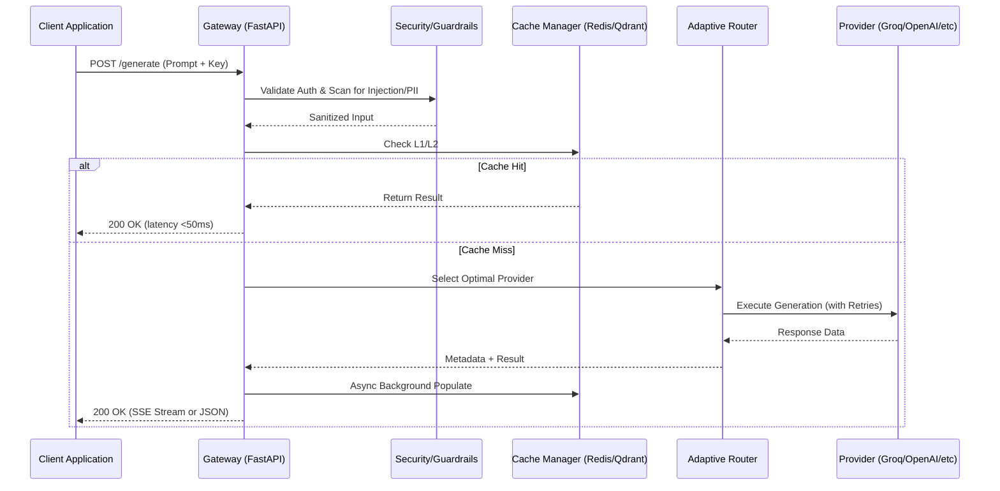

# 🏗️ System Architecture: LLM Gateway Platform

## 1. Executive Summary

The LLM Gateway is a high-performance, zero-trust orchestration layer designed to sit between application microservices and Large Language Model (LLM) providers. It provides a unified API surface while managing the complexities of **routing**, **cost-governance**, **resilience**, and **observability**.

## 2. Core Architectural Pillars

### 2.1 Adaptive Intelligence Layer
Unlike static proxies, the gateway employs an **Adaptive Router** based on a Multi-Armed Bandit (MAB) reinforcement learning algorithm.
- **Epsilon-Greedy Strategy**: The system spends 90% of traffic on the known "best" provider (based on a weighted score of latency/success/cost) and 10% on "exploration" to identify if performance has improved on other nodes.
- **Feedback Loop**: Latency and failure data are piped into Redis at sub-millisecond speeds to update routing weights in real-time.

### 2.2 Multi-Stage Caching (Exact + Semantic)
To minimize API egress and slash operational overhead, we utilize a tiered caching hierarchy:
- **L1 Cache (Exact)**: SHA-256 hashed prompt lookup in Redis for O(1) retrieval of frequent identical requests.
- **L2 Cache (Semantic)**: Vector-similarity search using `SentenceTransformers` and `Qdrant`.
    - **Thresholding**: We use a cosine similarity threshold (default 0.95) to serve results that are conceptually identical even if the syntax varies.
    - **Dogpile Protection**: We implement distributed asyncio locks to prevent "Cache Stampedes" when the cache is cold.

### 2.3 Security & Multi-Tenancy
The system is built on a "Zero Trust" model for internal tenants.
- **Token Bucket Rate Limiting**: Implemented via atomic Redis Lua scripts to handle burst traffic with mathematical precision.
- **InputGuard**: A dual-stage validation engine that scans for **Prompt Injections** (system-prompt bypass) and **PII Leakage** (Regex-based SSN/Email/Credit Card filtering) before data ever leaves the VPC.
- **Financial Enforcement**: Every request checks a Redis-backed atomic balance to ensure tenants do not exceed their monthly USD quotas.

## 3. Data Flow Diagram

## 4. Resilience & Chaos Strategy

We design for failure (SRE Mindset):
- **Circuit Breaker Pattern**: If a provider (e.g., Anthropic) crosses an error threshold, the gateway trips the circuit and redirects all traffic to the next best healthy provider (Gemini/OpenAI) for a cool-down period.
- **Chaos Controller**: An administrative interface allows for the manual injection of latency and failure rates to verify the system's "Self-Healing" capabilities under stress.

## 5. Observability Stack

- **Distributed Tracing**: Native OpenTelemetry (OTel) instrumentation. Spans capture the full lifecycle: Auth Overhead -> Cache Latency -> Provider Time -> Stream Transfer.
- **Cost Metrics**: Custom Prometheus hooks track USD spending per model and per tenant, enabling real-time financial reporting.
- **Structured Audit**: All administrative actions and high-priority requests are serialized to JSON and piped to security logs for compliance (SOC2/ISO).

---
*Created by the LLM Gateway Engineering Team*
